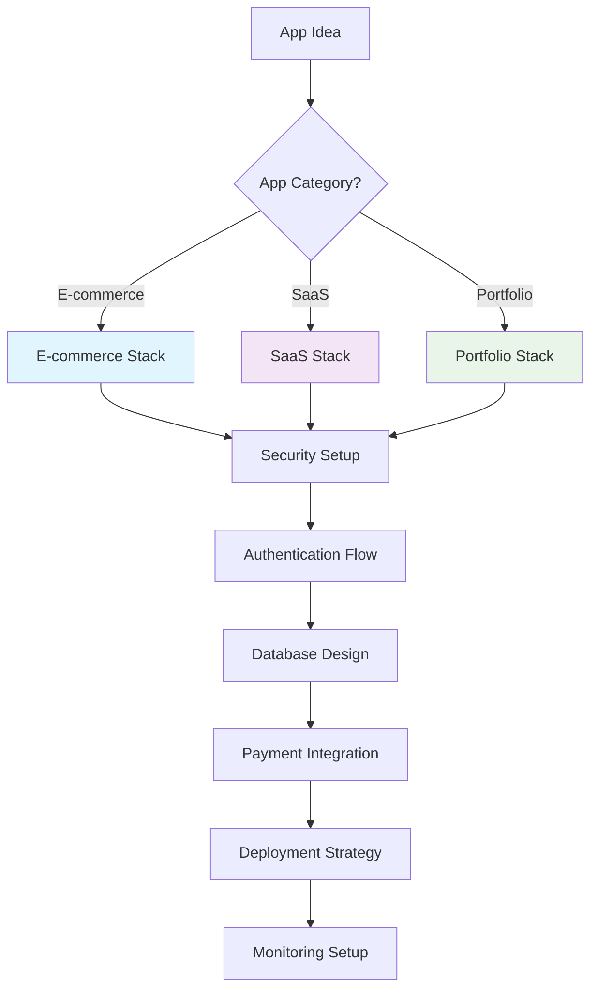

# 🎯 **VIBE-BUILDER: INTELLIGENT MVP GUIDE**
*Not just templates - Complete guided journey from idea to deployment*

---

## 🚫 **WHAT WE ARE NOT**

### ❌ **Generic Template Library**
```
User: "I want to build an app"
Bad Response: "Here are 200+ templates, pick one"
Problem: Overwhelming, no guidance, user still lost
```

### ❌ **Code Generator Without Context**
```
User: "Generate me a login system"
Bad Response: Just generates code without security considerations
Problem: Insecure, incomplete, no best practices
```

### ❌ **Jack-of-All-Trades Platform**
```
Bad Approach: Support every possible tech stack and use case
Problem: Diluted focus, mediocre results everywhere
```

---

## ✅ **WHAT WE ARE**

### 🎯 **INTELLIGENT DECISION GUIDE**
*We make the hard choices so users don't have to*

```typescript
// Example: E-commerce App Flow
const ecommerceGuide = {
  step1: {
    question: "What type of products will you sell?",
    options: ["Physical products", "Digital products", "Services"],
    impact: "Determines payment gateway, inventory system, shipping logic"
  },
  
  step2: {
    question: "Expected traffic volume?",
    options: ["< 1000 users/month", "1K-10K users/month", "10K+ users/month"],
    impact: "Determines hosting strategy, database choice, caching needs"
  },
  
  recommended_stack: {
    frontend: "Next.js 14 (App Router)",
    backend: "Supabase Edge Functions",
    database: "PostgreSQL with RLS",
    payments: "Stripe Checkout",
    hosting: "Vercel",
    reasoning: "Optimized for SEO, scalable, secure payments, easy deployment"
  }
}
```

### 🛣 **OPINIONATED PATHWAY CREATOR**
*One optimal path, not 50 mediocre options*



### 🎪 **COMPLETE EXPERIENCE ORCHESTRATOR**
*From idea to production in guided steps*

```typescript
interface GuidedExperience {
  discovery: {
    questions: SmartQuestion[]
    recommendations: TechStackRecommendation
    timeline_estimate: string
    complexity_score: number
  }
  
  implementation: {
    ordered_steps: ImplementationStep[]
    security_checkpoints: SecurityCheck[]
    testing_requirements: TestCase[]
    deployment_strategy: DeploymentPlan
  }
  
  post_launch: {
    monitoring_setup: MonitoringConfig
    scaling_guidance: ScalingPlan
    maintenance_schedule: MaintenanceTask[]
  }
}
```

---

## 🧠 **OUR INTELLIGENT GUIDANCE SYSTEM**

### **1. SMART DISCOVERY PHASE**

Instead of asking: *"What do you want to build?"*
We ask strategic questions:

```typescript
const discoveryFlow = {
  business_context: [
    "Who is your target audience?",
    "What problem are you solving?", 
    "How will you monetize?",
    "What's your technical expertise level?"
  ],
  
  technical_requirements: [
    "Do you need real-time features?",
    "Will you handle sensitive data?",
    "Expected user growth trajectory?",
    "Integration requirements?"
  ],
  
  constraints: [
    "Budget limitations?",
    "Timeline requirements?", 
    "Team size and skills?",
    "Compliance requirements?"
  ]
}
```

### **2. OPINIONATED STACK SELECTION**

Based on answers, we provide **ONE OPTIMAL STACK**, not choices:

```typescript
// Example: SaaS Application
const saasRecommendation = {
  stack: {
    frontend: "Next.js 14 + TypeScript",
    styling: "Tailwind CSS + Shadcn/UI",
    backend: "Supabase (Auth + Database + Edge Functions)",
    payments: "Stripe",
    hosting: "Vercel",
    monitoring: "Supabase Analytics + Sentry"
  },
  
  reasoning: {
    why_nextjs: "SEO-friendly, great DX, Vercel integration",
    why_supabase: "Built-in auth, RLS, real-time, edge functions",
    why_stripe: "Industry standard, excellent docs, global reach",
    why_vercel: "Zero-config deployment, edge network, preview URLs"
  },
  
  alternatives_not_chosen: {
    react_spa: "SEO challenges, complex auth setup",
    firebase: "Vendor lock-in, complex pricing, limited SQL",
    aws: "Over-engineering for MVP, steep learning curve"
  }
}
```

### **3. STEP-BY-STEP IMPLEMENTATION GUIDE**

```typescript
const implementationPlan = {
  week1: {
    title: "Foundation & Authentication",
    tasks: [
      {
        task: "Setup Next.js project with TypeScript",
        prompts: ["Create Next.js project with app router", "Configure TypeScript strict mode"],
        security_focus: "Enable CSP headers, configure environment variables"
      },
      {
        task: "Implement Supabase authentication",
        prompts: ["Setup OAuth providers", "Create login/signup forms"],
        security_focus: "Configure RLS policies, secure session management"
      }
    ]
  },
  
  week2: {
    title: "Core Business Logic",
    tasks: [
      {
        task: "Design database schema",
        prompts: ["Create user management tables", "Setup subscription tracking"],
        security_focus: "Implement row-level security, audit logging"
      }
    ]
  }
  // ... more weeks
}
```

### **4. CONTEXTUAL PROMPT ENGINEERING**

We don't just generate code - we provide **context-aware prompts**:

```typescript
const contextualPrompts = {
  authentication: {
    basic_prompt: "Create a login form",
    enhanced_prompt: `
      Create a secure login form for a SaaS application with:
      - Email/password + OAuth (Google, GitHub)
      - Input validation with Zod schemas
      - Rate limiting protection
      - CSRF protection
      - Accessible design (WCAG 2.1)
      - Loading states and error handling
      - Remember me functionality
      - Password strength meter
      - MFA preparation hooks
      
      Use: Next.js 14, TypeScript, Tailwind CSS, Supabase Auth
      Security: Include proper error messages without info leakage
    `
  },
  
  payment_integration: {
    context: "E-commerce checkout for physical products",
    prompt: `
      Create Stripe checkout integration with:
      - Tax calculation based on location
      - Shipping cost calculation
      - Inventory validation before payment
      - Webhook handling for order fulfillment
      - Idempotency for duplicate payments
      - PCI compliance considerations
      - Failed payment retry logic
      
      Include error handling for: expired cards, insufficient funds,
      network timeouts, webhook verification failures
    `
  }
}
```

---

## 🏗 **OUR GUIDED ARCHITECTURE APPROACH**

### **Instead of**: "Pick your backend"
### **We provide**: "Here's your optimal backend setup"

```typescript
const guidedArchitecture = {
  for_saas_app: {
    architecture: "Serverless + Database",
    
    components: {
      frontend: {
        tech: "Next.js 14 (App Router)",
        why: "SEO, performance, developer experience",
        deployment: "Vercel (zero-config, global CDN)"
      },
      
      backend: {
        tech: "Supabase Edge Functions",
        why: "TypeScript, global deployment, integrated with DB",
        patterns: ["RESTful APIs", "Webhook handlers", "Scheduled jobs"]
      },
      
      database: {
        tech: "PostgreSQL (Supabase)",
        why: "ACID compliance, RLS, real-time subscriptions",
        security: "Row-level security, encrypted at rest/transit"
      },
      
      auth: {
        tech: "Supabase Auth",
        why: "Multi-provider OAuth, JWT tokens, MFA ready",
        security: "Session management, password policies, audit logs"
      }
    },
    
    security_by_default: [
      "HTTPS everywhere",
      "CSP headers configured", 
      "XSS protection enabled",
      "CSRF tokens implemented",
      "Rate limiting on all endpoints",
      "Input validation with Zod",
      "SQL injection prevention via RLS",
      "Secrets management via environment variables"
    ]
  }
}
```

---

## 🎯 **USER JOURNEY TRANSFORMATION**

### **OLD WAY (Template Library)**
```
1. User arrives confused
2. Sees 100+ templates
3. Spends hours comparing
4. Picks wrong template
5. Realizes it doesn't fit
6. Starts over or gives up
```

### **NEW WAY (Intelligent Guide)**
```
1. User describes their idea
2. We ask 5-7 smart questions
3. We recommend ONE optimal stack
4. We provide step-by-step plan
5. We generate contextual prompts
6. User builds confidently
7. We guide through deployment
8. We provide post-launch guidance
```

---

## 🎪 **COMPLETE EXPERIENCE ORCHESTRATION**

### **Phase 1: Discovery & Planning**
```typescript
const discoveryPhase = {
  smart_questionnaire: {
    business_questions: [
      "What problem does your app solve?",
      "Who is your target user?",
      "How will you make money?",
      "What's your timeline?"
    ],
    
    technical_questions: [
      "Do you need user authentication?",
      "Will you handle payments?", 
      "Do you need real-time features?",
      "What's your team's technical level?"
    ]
  },
  
  ai_analysis: {
    input: "User responses + industry best practices",
    output: "Customized tech stack + implementation plan"
  }
}
```

### **Phase 2: Guided Implementation**
```typescript
const implementationPhase = {
  week_by_week_plan: [
    {
      week: 1,
      focus: "Authentication & Security Foundation",
      deliverables: ["User login/signup", "Database setup", "Security policies"],
      guided_prompts: ["Setup Supabase auth with RLS", "Create secure user forms"],
      checkpoints: ["Security review", "Authentication testing"]
    },
    {
      week: 2, 
      focus: "Core Business Logic",
      deliverables: ["Main app features", "Database schema", "API endpoints"],
      guided_prompts: ["Implement CRUD operations", "Add data validation"],
      checkpoints: ["Feature testing", "Performance review"]
    }
    // ... more weeks
  ]
}
```

### **Phase 3: Deployment & Optimization**
```typescript
const deploymentPhase = {
  deployment_strategy: {
    platform: "Vercel", // We choose for them
    ci_cd: "GitHub Actions", // Pre-configured
    monitoring: "Supabase + Sentry", // Integrated setup
    domain: "Custom domain setup guide"
  },
  
  post_launch_guidance: {
    monitoring_setup: "Real-time dashboards",
    performance_optimization: "Core Web Vitals improvement",
    security_hardening: "Production security checklist",
    scaling_preparation: "Traffic growth planning"
  }
}
```

---

## 🧭 **EXAMPLE: E-COMMERCE JOURNEY**

### **User Input**: "I want to sell handmade jewelry online"

### **Our Intelligent Response**:

```typescript
const jewelryEcommerceGuide = {
  analysis: {
    business_type: "Physical products e-commerce",
    complexity: "Medium",
    key_requirements: ["Product catalog", "Inventory", "Shipping", "Payments"],
    estimated_timeline: "4-6 weeks"
  },
  
  recommended_stack: {
    frontend: "Next.js 14 + TypeScript (SEO crucial for product discovery)",
    cms: "Supabase + Uploadcare (product images)",
    payments: "Stripe (supports international shipping)",
    inventory: "Custom Supabase tables with real-time sync",
    hosting: "Vercel (global CDN for fast image loading)"
  },
  
  step_by_step_plan: {
    week1: "Product catalog + image management",
    week2: "Shopping cart + checkout flow", 
    week3: "Inventory management + order processing",
    week4: "Payment integration + shipping calculator",
    week5: "SEO optimization + launch preparation",
    week6: "Analytics setup + post-launch monitoring"
  },
  
  contextual_prompts: [
    {
      phase: "Product Catalog",
      prompt: `Create a jewelry product catalog with:
        - High-quality image galleries (multiple angles)
        - Size/material variant selection
        - Inventory tracking per variant
        - SEO-optimized product pages
        - Related products suggestions
        - Customer reviews integration
        Use: Next.js, Supabase, Uploadcare for images`
    },
    {
      phase: "Checkout Experience", 
      prompt: `Build jewelry e-commerce checkout with:
        - Size guide integration
        - Gift wrapping options
        - Multiple shipping methods
        - Tax calculation by location
        - Abandoned cart recovery
        - Order confirmation emails
        Security: PCI compliance, secure payment flow`
    }
  ]
}
```

---

## 🎯 **SUCCESS METRICS**

### **Instead of measuring**: Template downloads
### **We measure**: Successful deployments

```typescript
const successMetrics = {
  user_journey_completion: {
    discovery_to_plan: "90%+ users get a clear plan",
    plan_to_implementation: "80%+ users start building", 
    implementation_to_deployment: "70%+ users deploy successfully",
    deployment_to_live: "90%+ deployments go live"
  },
  
  quality_indicators: {
    security_score: "95%+ apps pass security checklist",
    performance_score: "90%+ apps score >90 on Lighthouse",
    user_satisfaction: "85%+ users rate experience 4+ stars",
    time_to_deploy: "Average 2-4 weeks from idea to live app"
  }
}
```

---

## 🏆 **COMPETITIVE ADVANTAGE**

### **Others provide**: Tools and templates
### **We provide**: Guided expertise and decision-making

```typescript
const competitiveAdvantage = {
  vs_template_libraries: {
    them: "Here are 500 templates, good luck",
    us: "Based on your needs, here's THE optimal solution"
  },
  
  vs_ai_code_generators: {
    them: "Generate code without context or security",
    us: "Generate secure, production-ready code with best practices"
  },
  
  vs_no_code_platforms: {
    them: "Limited customization, vendor lock-in",
    us: "Full code ownership, unlimited customization, standard technologies"
  },
  
  vs_tutorial_sites: {
    them: "Generic tutorials, outdated practices",
    us: "Personalized guidance, current best practices, complete journey"
  }
}
```

---

## 🚀 **IMPLEMENTATION ROADMAP**

### **Phase 1: Intelligent Discovery Engine**
- Smart questionnaire system
- AI-powered stack recommendation
- Personalized project timeline generation

### **Phase 2: Guided Implementation System**
- Step-by-step weekly plans  
- Contextual prompt generation
- Security checkpoint validation

### **Phase 3: Deployment Orchestration**
- One-click deployment pipelines
- Automated monitoring setup
- Post-launch optimization guides

### **Phase 4: Continuous Guidance**
- Performance monitoring
- Scaling recommendations
- Feature evolution guidance

---

## 🎯 **CONCLUSION**

**Vibe-Builder is not a template library.**

**Vibe-Builder is your AI technical co-founder** that:
- Makes the hard technical decisions for you
- Provides opinionated, battle-tested solutions
- Guides you step-by-step from idea to production
- Ensures security and best practices by default
- Gives you complete code ownership and flexibility

**We don't give you options. We give you the RIGHT answer.**

---

**🧭 From overwhelmed to deployed. From idea to income. Let's build something amazing.** 