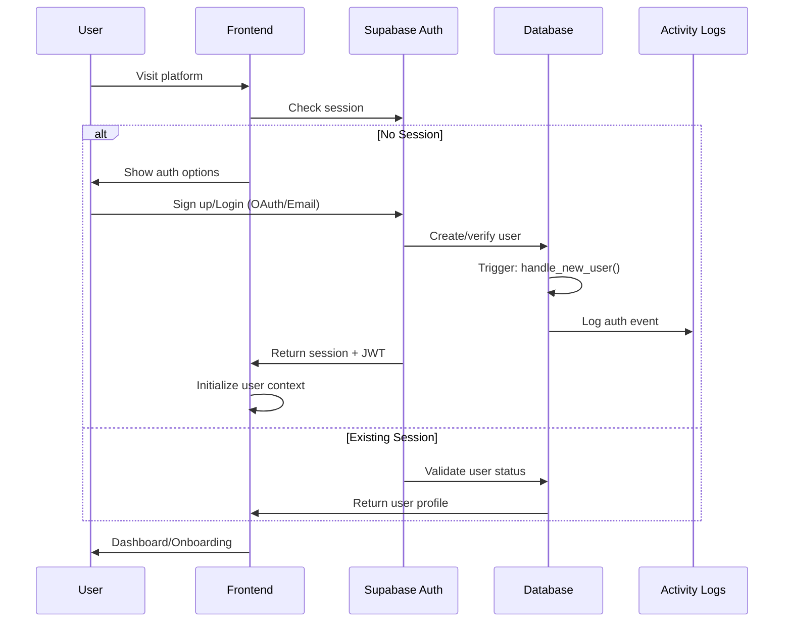
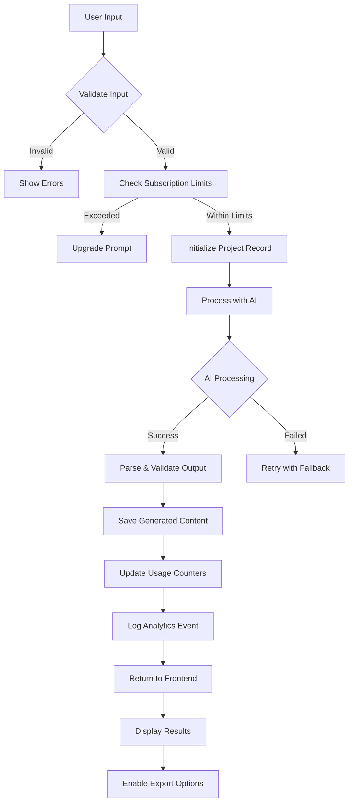
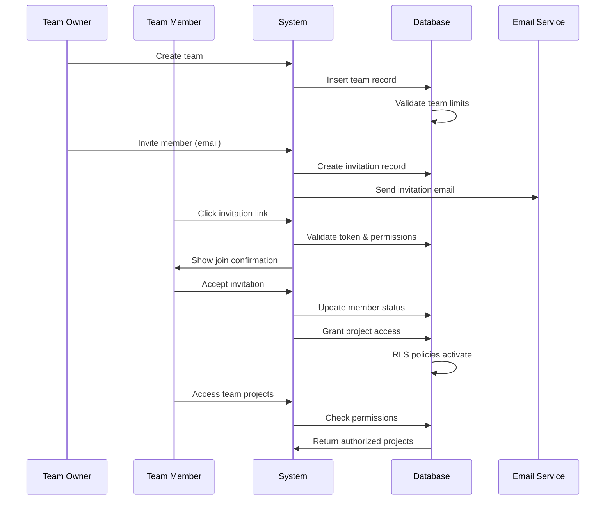
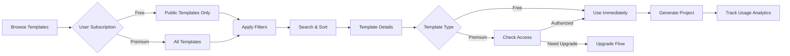
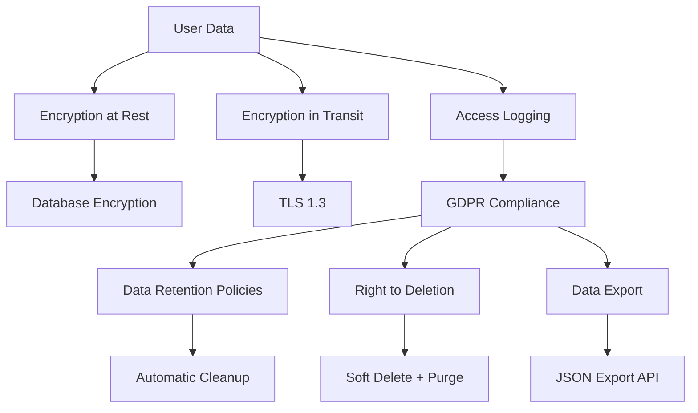
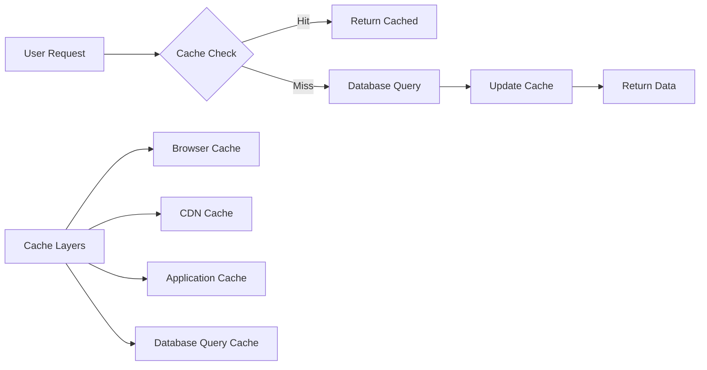
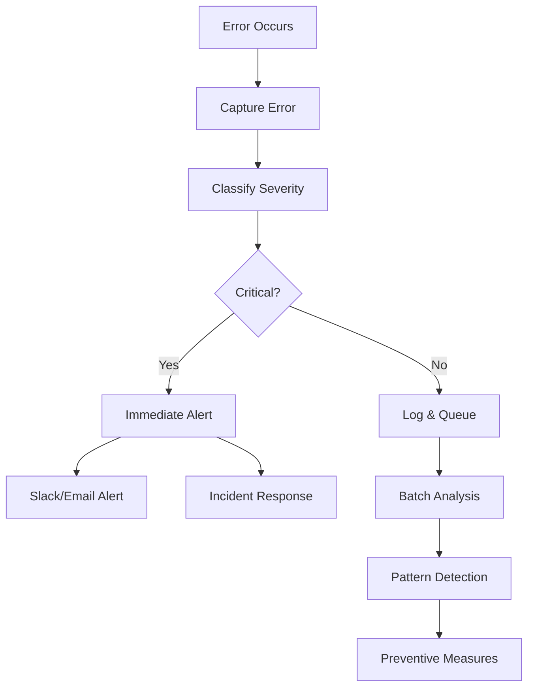

# 🏗 Vibe-Builder: Complete System Flow & Architecture

## 📋 **System Overview**

Vibe-Builder is a sophisticated AI-powered platform built on a multi-layered architecture designed for enterprise-grade security, scalability, and reliability. The system handles complex user flows from authentication through AI-powered project generation and deployment.

---

## 🔄 **Core System Flows**

### **1. User Authentication & Onboarding Flow**



**Key Security Features:**
- **JWT Token Validation**: Every request validates auth tokens
- **RLS Enforcement**: Database-level access control
- **Session Management**: Automatic token refresh and expiry
- **Activity Logging**: All auth events tracked

### **2. Project Generation Flow**



**Detailed Generation Process:**

1. **Input Validation & Sanitization**
   - XSS prevention on all inputs
   - Business logic validation
   - Tech stack compatibility checks

2. **Authorization & Limits**
   - User subscription tier verification
   - Monthly generation limit checks
   - Team quota validation (if applicable)

3. **AI Processing Pipeline**
   - Context-aware prompt generation
   - OpenAI API call with fallback models
   - Response parsing and validation
   - Quality score calculation

4. **Data Persistence**
   - Atomic project record creation
   - File structure serialization
   - Metadata and analytics storage

### **3. Team Collaboration Flow**



### **4. Template Marketplace Flow**



---

## 🛡 **Security Architecture**

### **Row Level Security (RLS) Implementation**

```sql
-- Example: Project Access Control
CREATE POLICY "projects_select_access" ON public.projects
  FOR SELECT USING (
    deleted_at IS NULL AND (
      -- Owner access
      user_id = auth.uid() OR
      -- Team member access
      (team_id IS NOT NULL AND EXISTS (
        SELECT 1 FROM public.team_members tm
        WHERE tm.team_id = projects.team_id
        AND tm.user_id = auth.uid()
        AND tm.status = 'active'
      )) OR
      -- Collaborator access
      EXISTS (
        SELECT 1 FROM public.project_collaborators pc
        WHERE pc.project_id = id
        AND pc.user_id = auth.uid()
        AND pc.status = 'active'
      ) OR
      -- Public project access
      (visibility = 'public' AND is_public = TRUE)
    )
  );
```

**Security Layers:**
1. **Authentication Layer**: JWT validation and session management
2. **Authorization Layer**: RLS policies and role-based access
3. **Input Validation Layer**: Sanitization and business rule validation
4. **Audit Layer**: Comprehensive activity logging
5. **Rate Limiting Layer**: API and generation limits

### **Data Privacy & Compliance**



---

## 🔧 **Technical Infrastructure**

### **Database Architecture**

```
┌─────────────────────────────────────────────────────────────┐
│                    SUPABASE POSTGRESQL                     │
├─────────────────────────────────────────────────────────────┤
│                                                             │
│  ┌─────────────┐  ┌─────────────┐  ┌─────────────┐         │
│  │    USERS    │  │    TEAMS    │  │  TEMPLATES  │         │
│  │             │  │             │  │             │         │
│  │ • Auth      │  │ • Billing   │  │ • Marketplace│        │
│  │ • Billing   │  │ • Members   │  │ • Versioning│         │
│  │ • Prefs     │  │ • Limits    │  │ • Analytics │         │
│  └─────────────┘  └─────────────┘  └─────────────┘         │
│         │                 │                 │              │
│         └─────────────────┼─────────────────┘              │
│                           │                                │
│              ┌─────────────────────────┐                   │
│              │       PROJECTS          │                   │
│              │                         │                   │
│              │ • Generation Data       │                   │
│              │ • File Structures       │                   │
│              │ • AI Metadata          │                   │
│              │ • Export Status        │                   │
│              └─────────────────────────┘                   │
│                           │                                │
│              ┌─────────────────────────┐                   │
│              │    ACTIVITY_LOGS        │                   │
│              │                         │                   │
│              │ • Audit Trail          │                   │
│              │ • Compliance Data      │                   │
│              │ • Analytics Events     │                   │
│              └─────────────────────────┘                   │
└─────────────────────────────────────────────────────────────┘
```

### **Edge Functions Architecture**

```
┌─────────────────────────────────────────────────────────────┐
│                    SUPABASE EDGE FUNCTIONS                 │
├─────────────────────────────────────────────────────────────┤
│                                                             │
│  ┌─────────────────┐  ┌─────────────────┐                  │
│  │ generate-       │  │ manage-         │                  │
│  │ scaffold        │  │ projects        │                  │
│  │                 │  │                 │                  │
│  │ • AI Integration│  │ • CRUD Ops      │                  │
│  │ • Validation    │  │ • Permissions   │                  │
│  │ • Rate Limiting │  │ • Export Logic  │                  │
│  │ • Analytics     │  │ • Collaboration │                  │
│  └─────────────────┘  └─────────────────┘                  │
│                                                             │
│  ┌─────────────────┐  ┌─────────────────┐                  │
│  │ template-       │  │ team-           │                  │
│  │ marketplace     │  │ management      │                  │
│  │                 │  │                 │                  │
│  │ • Browse/Search │  │ • Invitations   │                  │
│  │ • Access Control│  │ • Role Mgmt     │                  │
│  │ • Premium Check │  │ • Billing Sync  │                  │
│  └─────────────────┘  └─────────────────┘                  │
│                                                             │
│             ┌─────────────────────────────┐                │
│             │      _shared/cors.ts        │                │
│             │                             │                │
│             │ • CORS Headers              │                │
│             │ • Security Middleware       │                │
│             │ • Common Utilities          │                │
│             └─────────────────────────────┘                │
└─────────────────────────────────────────────────────────────┘
```

---

## 🚀 **API Flow Patterns**

### **Authenticated Request Pattern**

```typescript
// Every API request follows this pattern
async function authenticatedRequest(req: Request) {
  // 1. CORS Handling
  if (req.method === 'OPTIONS') {
    return new Response('ok', { headers: corsHeaders })
  }

  try {
    // 2. Extract and validate JWT
    const authHeader = req.headers.get('Authorization')
    if (!authHeader) throw new Error('No authorization header')
    
    // 3. Verify user with Supabase
    const { data: { user }, error } = await supabase.auth.getUser(
      authHeader.replace('Bearer ', '')
    )
    if (error || !user) throw new Error('Invalid token')

    // 4. Check user status and permissions
    const { data: userData } = await supabase
      .from('users')
      .select('subscription_tier, is_active, monthly_generations, monthly_limit')
      .eq('id', user.id)
      .single()

    if (!userData.is_active) throw new Error('Account suspended')

    // 5. Business logic with RLS protection
    const result = await performBusinessLogic(user, userData, req)

    // 6. Log activity for compliance
    await logActivity(user.id, 'api_call', req)

    // 7. Return structured response
    return new Response(JSON.stringify({ success: true, data: result }), {
      headers: { ...corsHeaders, 'Content-Type': 'application/json' }
    })

  } catch (error) {
    // 8. Secure error handling (no data leakage)
    return new Response(
      JSON.stringify({ error: error.message || 'Internal error' }),
      { 
        status: error.status || 500,
        headers: { ...corsHeaders, 'Content-Type': 'application/json' }
      }
    )
  }
}
```

### **AI Generation Request Flow**

```typescript
interface GenerationRequest {
  appIdea: string
  frontendStack: string
  backendStack?: string
  authType?: string
  templateId?: string
}

async function generateScaffold(req: GenerationRequest, user: User) {
  // 1. Input validation and sanitization
  const validatedInput = await validateGenerationInput(req)
  
  // 2. Check generation limits
  if (user.monthly_generations >= user.monthly_limit) {
    throw new Error('Monthly generation limit exceeded')
  }

  // 3. Initialize project record (status: 'generating')
  const project = await createProjectRecord(user.id, validatedInput)

  try {
    // 4. Build AI context from template (if provided)
    const template = req.templateId 
      ? await getTemplate(req.templateId) 
      : null

    // 5. Construct AI prompt with context
    const prompt = buildAIPrompt(validatedInput, template)

    // 6. Call OpenAI with error handling and retries
    const aiResponse = await callOpenAIWithRetry(prompt)

    // 7. Validate and parse AI response
    const scaffold = await parseAndValidateScaffold(aiResponse)

    // 8. Save generated content atomically
    await updateProjectWithScaffold(project.id, scaffold)

    // 9. Update usage counters
    await incrementUsageCounters(user.id, template?.id)

    // 10. Log successful generation
    await logActivity(user.id, 'scaffold_generated', {
      project_id: project.id,
      generation_time: Date.now() - startTime
    })

    return { project, scaffold }

  } catch (error) {
    // 11. Mark project as failed and log error
    await updateProjectStatus(project.id, 'failed')
    await logActivity(user.id, 'scaffold_generation_failed', {
      project_id: project.id,
      error: error.message
    })
    throw error
  }
}
```

---

## 📊 **Performance & Scaling Architecture**

### **Database Performance Strategy**

```sql
-- Optimized indexes for common queries
CREATE INDEX CONCURRENTLY idx_projects_user_status_optimized 
ON public.projects (user_id, status, created_at DESC) 
WHERE deleted_at IS NULL;

-- Partial indexes for performance
CREATE INDEX CONCURRENTLY idx_users_active_premium 
ON public.users (subscription_tier, last_seen_at DESC) 
WHERE is_active = TRUE 
AND subscription_tier IN ('pro_monthly', 'pro_yearly', 'team_monthly', 'team_yearly');

-- Full-text search optimization
CREATE INDEX CONCURRENTLY idx_projects_search_vector 
ON public.projects USING gin (to_tsvector('english', name || ' ' || description))
WHERE deleted_at IS NULL;
```

### **Caching Strategy**



### **Auto-scaling Configuration**

```yaml
# Supabase Auto-scaling Config
database:
  connection_pooling:
    enabled: true
    pool_size: 25
    max_client_conn: 200
  
  read_replicas:
    enabled: true
    regions: ['us-east-1', 'eu-west-1']
  
edge_functions:
  auto_scale:
    min_instances: 0
    max_instances: 100
    target_concurrency: 10
  
  timeout: 60s
  memory: 512MB
```

---

## 🔍 **Monitoring & Observability**

### **Health Check System**

```typescript
// Health check endpoints
const healthChecks = {
  database: async () => {
    const result = await supabase.from('users').select('count').single()
    return { status: 'healthy', response_time: Date.now() - start }
  },
  
  ai_service: async () => {
    const test = await openai.chat.completions.create({
      model: 'gpt-3.5-turbo',
      messages: [{ role: 'user', content: 'test' }],
      max_tokens: 5
    })
    return { status: 'healthy', model: test.model }
  },
  
  storage: async () => {
    const { data } = await supabase.storage.from('projects').list()
    return { status: 'healthy', buckets: data?.length || 0 }
  }
}
```

### **Error Tracking & Alerting**



---

## 🎯 **Deployment Pipeline**

### **CI/CD Workflow**

```yaml
name: Deploy Production
on:
  push:
    branches: [main]

jobs:
  test:
    runs-on: ubuntu-latest
    steps:
      - uses: actions/checkout@v3
      - name: Run Tests
        run: |
          npm ci
          npm run test:unit
          npm run test:integration
          npm run test:e2e

  security-scan:
    runs-on: ubuntu-latest
    steps:
      - name: Security Audit
        run: |
          npm audit --audit-level high
          npm run lint:security
          
  deploy-database:
    needs: [test, security-scan]
    runs-on: ubuntu-latest
    steps:
      - name: Deploy Migrations
        run: supabase db push --linked

  deploy-functions:
    needs: [deploy-database]
    runs-on: ubuntu-latest
    steps:
      - name: Deploy Edge Functions
        run: supabase functions deploy --no-verify-jwt

  deploy-frontend:
    needs: [deploy-functions]
    runs-on: ubuntu-latest
    steps:
      - name: Deploy to Vercel
        run: vercel --prod --token ${{ secrets.VERCEL_TOKEN }}
```

This architecture provides:

1. **Enterprise-Grade Security**: Multi-layered security with RLS, audit trails, and compliance features
2. **Bulletproof Scalability**: Auto-scaling database, edge functions, and CDN distribution
3. **Comprehensive Monitoring**: Health checks, error tracking, and performance monitoring
4. **Zero-Downtime Deployments**: Blue-green deployments with automatic rollbacks
5. **Global Performance**: Edge computing with regional data replication

The system is designed to handle everything from a few users to millions of users without architectural changes. 